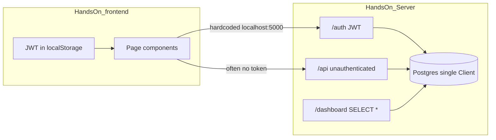
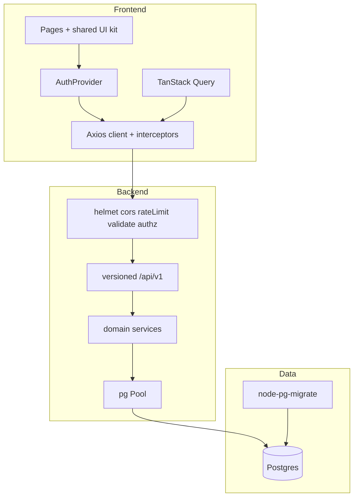

# HandsOn Production Modernization Plan

**Project:** HandsOn — Community-Driven Social Volunteering Platform  
**Purpose:** Evolve the student-life MVP into a production-ready, resume-showcase product  
**Status:** Phase 3 complete — ready for Phase 4  
**Estimated timeline:** ~8 weeks (part-time) or ~4–5 weeks (focused full-time)

---

## 1. Goal

Turn HandsOn into a **resume-ready, deployable product** that demonstrates:

- Secure, maintainable full-stack engineering
- Strong product thinking (matching + impact)
- Polished UI/UX and mobile usability
- Production hygiene: migrations, tests, CI, Docker, live demo

**Primary differentiator:** skills/causes-based event matching + verified volunteer impact metrics.

### Chosen technical approach (locked)

| Decision | Choice |
|----------|--------|
| Strategy | Evolve existing stack — not a greenfield rewrite |
| Frontend | React 19 + Vite + Tailwind + DaisyUI (refined design system) |
| Backend | Node.js + Express + PostgreSQL + JWT |
| Typing | Incremental TypeScript on new/critical paths |
| Realtime | In-app notifications (poll); defer WebSocket chat |
| Deploy | Docker Compose locally; Render/Railway (API+DB) + Vercel/Netlify (SPA) |

---

## 2. Current State Audit

### 2.1 Repository layout

```
hands-on-volunteering-platform/
├── HandsOn_frontend/     # Vite + React SPA (~25 source files)
├── HandsOn_Server/       # Express API (~10 source files, ~1k LOC)
└── README.md             # Schema + API docs (partly aspirational)
```

### 2.2 What already works well

- Clear domain model: users, events, help posts, teams
- Password hashing with bcrypt on register/login
- JWT issuance for auth
- Parameterized SQL (`$1`, `$2`, …) — no classic SQL injection in app queries
- Modern frontend baseline: React 19, Vite 6, Tailwind 4, React Router 7

### 2.3 Architecture today



### 2.4 Backend inventory

| Path | Purpose |
|------|---------|
| `HandsOn_Server/server.js` | Entry: JSON, open CORS, mounts `/auth`, `/api`, `/dashboard`; port hardcoded `5000` |
| `HandsOn_Server/db.js` | Single `pg.Client` with **hardcoded** DB credentials |
| `HandsOn_Server/middleware/authorization.js` | JWT verify via custom `token` header |
| `HandsOn_Server/utils/jwtGenerator.js` | Signs `{ user: user_id }`, 1h expiry |
| `HandsOn_Server/routes/jwtAuth.js` | Register, login, is-verify |
| `HandsOn_Server/routes/dashboard.js` | Authenticated current-user fetch (`SELECT *`) |
| `HandsOn_Server/routes/userRoutes.js` | All domain REST routes — **no auth middleware** |
| `HandsOn_Server/controllers/userController.js` | Handlers for users/events/help/teams |
| `HandsOn_Server/models/userModel.js` | All SQL in one god-file |

**Missing:** migrations, tests, validators, rate limiting, logging library, health check, connection pool.

### 2.5 Frontend inventory

| Path | Purpose |
|------|---------|
| `src/routes/AppRoute.jsx` | Routes + JWT gate in localStorage |
| `src/Pages/HomePage.jsx` + `components/HomeBody.jsx` | Landing |
| `src/Pages/login.jsx` / `registration.jsx` | Auth forms |
| `src/Pages/Dashboard.jsx` | Profile + **hardcoded** impact stats |
| `src/Pages/EditProfile.jsx` | Edit via `location.state` (fragile) |
| `src/Pages/Events.jsx` / `CreateEvent.jsx` | Event feed + create |
| `src/Pages/HelpReq.jsx` / `CreateHelpPost.jsx` | Help feed + create |
| `src/Pages/Teams.jsx` / `CreateTeams.jsx` / `TeamDash.jsx` | Teams |
| `src/Pages/components/SideBar.jsx` | Fixed sidebar — not mobile-safe |
| `src/Pages/components/NavBar.jsx` / `Footer.jsx` | Chrome |

**Missing:** shared API client, AuthProvider, env config, error boundaries, tests, 404 route.

### 2.6 Critical findings (fix first)

| # | Severity | Finding |
|---|----------|---------|
| 1 | Critical | DB credentials hardcoded in `HandsOn_Server/db.js` |
| 2 | Critical | Entire `/api/*` surface has **zero** authorization → IDOR on profile/event/help/team writes |
| 3 | Critical | `GET /dashboard/` returns full user row including **password hash** |
| 4 | High | Teams use `jwt.decode` (no signature verify) and inconsistent auth headers |
| 5 | High | Event capacity uses both `total_member` and `COUNT(join_event)` — race-prone, inconsistent |
| 6 | High | Frontend API URLs hardcoded to `http://localhost:5000` |
| 7 | High | Broken team routes: `/team/:teamId` unprotected; `/team-details/:id` param mismatch with `TeamDash` |
| 8 | Medium | No migrations (README “npm run migrate” is aspirational) |
| 9 | Medium | No tests, rate limits, helmet, input validation |
| 10 | Medium | Fake dashboard stats; mobile layout broken (`ml-64` + fixed sidebar); deceptive Google login UI |

### 2.7 API surface today (summary)

**Auth (partially protected)**

- `POST /auth/register`, `POST /auth/login`
- `GET /auth/is-verify` (requires `token` header)

**Dashboard**

- `GET /dashboard/` (auth) — leaks password hash

**Domain `/api` (unauthenticated)**

- Users: `GET/PUT /api/users/:id`
- Events: `POST /api/create-event/:id`, `GET /api/get-events`, `POST /api/join-event`
- Help: `POST /api/create-help-post/:id`, `GET /api/get-help-posts`, `GET /api/help-post/:postId`, `POST /api/help-post/comment`
- Teams: `POST /api/create-team/:id`, `GET /api/get-teams`, `POST /api/join-team/:teamId`, `GET /api/team/:teamId`

---

## 3. Target Architecture



### 3.1 Target backend layout

```
HandsOn_Server/
├── src/
│   ├── config/          # env validation (zod)
│   ├── middleware/      # auth, error, rateLimit, validate
│   ├── routes/          # auth, users, events, help, teams, health
│   ├── controllers/
│   ├── services/        # business rules
│   ├── repositories/    # SQL only
│   ├── validators/      # zod schemas
│   └── utils/
├── migrations/
├── seeds/
├── tests/
├── server.js
└── package.json
```

### 3.2 Target frontend layout

```
HandsOn_frontend/src/
├── api/                 # axios instance, resource modules
├── features/            # auth, events, help, teams, matching, impact
├── components/          # shared UI kit + AppShell
├── hooks/
├── context/             # AuthProvider
├── lib/                 # dates, cn(), constants
├── pages/
└── routes/
```

### 3.3 Target API conventions

- Base: `/api/v1`
- Auth header: `Authorization: Bearer <token>` only
- Response shape: `{ success, message, data, error? }`
- Creator/actor always taken from JWT — never trusted from body/path alone
- Public reads (optional): limited event/help lists; all mutations authenticated

---

## 4. Resume Narrative

After shipping, the project should support this story in interviews:

1. **Secure full-stack app** — authz, validation, migrations, Docker, live URL
2. **Product thinking** — match volunteers to opportunities; measure real impact
3. **Craft** — cohesive UI, mobile-first shell, loading/empty/error states, accessible forms

### Suggested resume bullets

- Built a volunteering platform with JWT auth, role-aware APIs, and versioned Postgres migrations
- Implemented skills/causes matching and impact dashboards driven by verified participation data
- Deployed a Dockerized Express API + React SPA with CI for lint, test, and build

### Demo script (≤3 minutes)

1. Register / login as volunteer  
2. See **Recommended for you** events from skills/causes  
3. Join event → switch to organizer → mark attendance  
4. Dashboard impact hours update from real data  
5. Optional: post/claim a help request; receive notification  

---

## 5. Phased Roadmap

### Phase 0 — Stabilize Foundations (Week 1)

**Theme:** Security and correctness before features.

#### Backend

- [x] Move secrets to env: `DATABASE_URL`, `JWT_SECRET`, `PORT`, `CLIENT_ORIGIN`, `NODE_ENV`
- [x] Remove hardcoded credentials from `HandsOn_Server/db.js`
- [x] Replace single `pg.Client` with `pg.Pool`
- [x] Mount auth middleware on all sensitive `/api` routes
- [x] Enforce subject == resource owner (fix IDOR on profile/event/help/team/join/comment)
- [x] Standardize `Authorization: Bearer`; remove all `jwt.decode` usage
- [x] Never `SELECT *` from users; strip `password` from all DTOs
- [x] Add `helmet`, CORS allowlist, `express-rate-limit` on `/auth`, body size limits
- [x] Central Express error middleware + consistent response envelope
- [x] Fix event capacity: one source of truth; transactional joins
- [x] Add DB constraints: `UNIQUE (event_id, user_id)`, `UNIQUE (team_id, user_id)`

#### Frontend

- [x] Create `src/api/client.js` with `VITE_API_URL`, Bearer injection, 401 → logout
- [x] Replace every hardcoded `localhost:5000` call
- [x] Fix team routing to one protected path: `/teams/:teamId`
- [x] Align Dashboard “View Details” links with TeamDash param name
- [x] Auth bootstrap gate (no flash redirect to login); validate JWT `exp`
- [x] Add `.env.example` for frontend and backend (never commit real `.env`)

#### Data

- [x] Introduce `node-pg-migrate` (or Knex)
- [x] Convert README schema into versioned migrations
- [x] Add seed script with demo users, events, teams for portfolio demos

**Exit criteria:** authenticated API only; no password leakage; env-driven config; team detail works end-to-end.

---

### Phase 1 — Code Hygiene and API Redesign (Weeks 2–3)

**Theme:** Maintainable structure and clean contracts.

#### API migration map

| Current | Target |
|---------|--------|
| `POST /auth/register` | `POST /api/v1/auth/register` (keep `/auth` aliases briefly if needed) |
| `POST /auth/login` | `POST /api/v1/auth/login` — same response shape as register |
| `GET /dashboard/` | `GET /api/v1/users/me` |
| `GET/PUT /api/users/:id` | `GET/PATCH /api/v1/users/:id` (self-only for write) |
| `POST /api/create-event/:id` | `POST /api/v1/events` |
| `GET /api/get-events` | `GET /api/v1/events` |
| `POST /api/join-event` | `POST /api/v1/events/:id/join` |
| `POST /api/create-help-post/:id` | `POST /api/v1/help-posts` |
| `GET /api/get-help-posts` | `GET /api/v1/help-posts` |
| `POST /api/help-post/comment` | `POST /api/v1/help-posts/:id/comments` |
| `POST /api/create-team/:id` | `POST /api/v1/teams` |
| `GET /api/get-teams` | `GET /api/v1/teams` |
| `POST /api/join-team/:teamId` | `POST /api/v1/teams/:id/join` |
| `GET /api/team/:teamId` | `GET /api/v1/teams/:id` |

#### Code structure

- [x] Split `userController.js` / `userModel.js` into domains: `users`, `events`, `helpPosts`, `teams`
- [x] Introduce service layer for business rules (capacity, privacy, ownership)
- [x] Zod (or Joi) validation per route
- [x] Incremental TypeScript for config, validators, and new modules
- [x] Shared ESLint + Prettier; add `format` script; make `lint` meaningful
- [x] `GET /health` for deploy probes
- [x] Structured logging with `pino` + request id
- [x] Light OpenAPI/Swagger for `/api/v1`

**Exit criteria:** layered backend; validated inputs; health endpoint; no god-files.

---

### Phase 2 — UI/UX System Rebuild (Weeks 3–5)

**Theme:** One composition, one brand, mobile-first shell.

#### Design direction

- Visual language: community / impact — earth and teal accents
- Avoid generic purple-on-white / purple-indigo AI-default look
- Expressive font pairing (display + body), not default system/Inter-only stack
- CSS variables for color, type scale, spacing, radius, elevation
- Cards only where they wrap real user interactions (lists, forms)

#### Shared UI kit

- [x] `Button`, `Input`, `Textarea`, `Select`, `Badge`
- [x] `EmptyState`, `Spinner` / skeletons, `Alert`, `Modal`
- [x] Toast system — replace all `alert()`
- [x] `AppShell`: responsive sidebar → **drawer on mobile**; top bar with user menu

#### Page priorities

1. **Landing** — brand-first full-bleed hero; one headline; one supporting line; Login/Register CTAs; real volunteering imagery; no fake hero overlays/stats clutter
2. **Auth** — remove fake Google SSO (or implement later); clear validation errors inline
3. **Dashboard** — metrics from API only; skeletons; null-safe profile render
4. **Events / Help / Teams** — consistent filters, loading/error/empty, disabled submit while pending
5. **Global** — 404 route; correct `index.html` title, favicon, meta

#### UX / a11y checklist

- [x] `htmlFor` / `id` on form controls
- [x] `aria-label` on icon-only buttons
- [x] Tables collapse to cards on small screens
- [x] Fix role badge template literal bug in `TeamDash.jsx`
- [x] Edit profile fetches by `:id` (not only router state); self-only authorization
- [x] Fix Events category filter (`All Categories` mismatch)
- [x] Remove or fix Footer stub links and duplicated registration options

**Exit criteria:** usable on phone; one visual language; no deceptive UI chrome.

---

### Phase 3 — Differentiator Features (Weeks 5–7)

**Theme:** Product depth that stands out on a resume.

#### A. Skills / causes matching (primary)

- [x] Normalize `skills` and `causes` as arrays (optional tag vocabulary table)
- [x] Event tags/category aligned with cause vocabulary
- [x] Endpoint: `GET /api/v1/events/recommended`
  - Score = skill overlap + cause overlap + simple location match
- [x] UI: “Recommended for you” on Events feed and Dashboard

#### B. Real impact metrics

- [x] Extend `join_event` with `status`: `registered | attended | no_show`
- [x] Organizer endpoint to mark attendance
- [x] Compute hours from event `start_time` / `end_time` × attended rows
- [x] Dashboard widgets from API: hours, events attended, help contributions, teams
- [x] Optional public impact snippet on profile

#### C. Help request workflow

- [x] Status: `open | in_progress | resolved`
- [x] Claim / assign helper to self
- [x] Urgency filter + sort (extend existing)

#### D. Team roles (lightweight org story)

- [x] Roles: `owner | admin | member`
- [x] Owner/admin: edit team, remove members, manage attendance on team events
- [x] Private teams: invite token or invite code table

#### E. In-app notifications

- [x] Table: `notifications (id, user_id, type, payload, read_at, created_at)`
- [x] Emit on: join confirmed, help comment, team invite, attendance marked
- [x] Bell dropdown in AppShell (poll every N seconds)

#### Explicitly deferred from v1

- WebSocket team chat
- Full maps SDK (optional later: OSM link or lat/lng)
- Payments / donations
- Native mobile apps
- Real Google OAuth (optional Phase 4+ if time)

**Exit criteria:** full demo script works: register → matches → join → verify attendance → impact updates.

---

### Phase 4 — Production Ops, Tests, Deploy (Weeks 7–8)

**Theme:** Prove it runs in the real world.

#### Quality

- [x] Backend tests (Vitest/Jest + Supertest): auth, IDOR negatives, join capacity, matching score
- [x] Frontend tests (Vitest + RTL): AuthProvider, API client, critical forms
- [ ] Optional Playwright smoke: login → create event → join

#### DevOps

- [x] Root `docker-compose.yml`: `db`, `api`, `web` (or API+DB + static host for web)
- [x] GitHub Actions: lint + test + build on PR
- [x] Deploy: Render/Railway (API + Postgres) + Vercel/Netlify (frontend) — documented (`docs/DEPLOY.md`); publish with account credentials
- [x] Production env vars documented; CORS locked to frontend origin

#### Portfolio packaging

- [x] README rewrite: architecture diagram, setup, env vars, demo credentials, screenshots
- [x] Seeded demo accounts documented
- [x] Short Loom walkthrough script for recruiters
- [x] Architecture / decisions section for interview talking points

**Exit criteria:** public URL; CI green; stranger can clone and run via Compose.  
_(Public URL requires your Render/Vercel deploy; Compose + CI cover the rest.)_

---

## 6. Implementation Order (When Coding Starts)

1. Env + Pool + migrations + auth on `/api`
2. Frontend API client + route/auth fixes
3. Split backend domains + Zod + error middleware + `/api/v1`
4. App shell + design tokens + landing/dashboard redesign
5. Matching + attendance/impact
6. Help status + team roles + notifications
7. Tests + Docker + CI + deploy + README

---

## 7. Schema Evolution (High Level)

### Keep and harden

- `users`, `events`, `join_event`, `help_post`, `help_post_comments`, `teams`, `team_members`

### Add / change

| Change | Why |
|--------|-----|
| Unique constraints on join tables | Prevent duplicate joins / races |
| `join_event.status` | Attendance verification |
| `events.tags` or `event_tags` | Matching input |
| `users.skills` as array (align with causes) | Consistent matching |
| `help_post.status`, optional `claimed_by` | Help workflow |
| `team_members.role` enforced as enum | Org story |
| `team_invites` | Private team access |
| `notifications` | In-app alerts |
| `help_post_comments.created_at` → `TIMESTAMPTZ` | Correct ordering |
| Drop or stop writing denormalized `events.total_member` | Single source of truth via COUNT |

---

## 8. Success Metrics

| Area | Target |
|------|--------|
| Security | No unauthenticated writes; no password in responses; secrets only in env |
| UX | Mobile usable; one design system; real stats only |
| Product | Matching + verified hours demoable in under 3 minutes |
| Engineering | Migrations, critical-path tests, CI, live deploy |
| Resume | Live link + clear differentiator story |

---

## 9. Risks and Mitigations

| Risk | Mitigation |
|------|------------|
| Breaking existing API paths | Version as `/api/v1`; update frontend in lockstep |
| Scope creep | Cut notifications / private invites before cutting security, matching, or impact |
| Existing messy DB | Migrations target empty/demo DB; document `docker compose down -v` reset |
| Time pressure | Ship Phase 0–2 + matching/impact; treat roles/notifications as stretch |
| `node_modules` noise in git | Ensure `.gitignore`; never commit dependencies or `.env` |

---

## 10. Out of Scope (This Modernization Pass)

- Full TypeScript rewrite of every file on day one
- Microservices or GraphQL
- Real-time chat
- Multi-tenant SaaS billing
- Committing secrets or `node_modules`

---

## 11. Week-by-Week Checklist (Condensed)

| Week | Focus | Done when |
|------|-------|-----------|
| 1 | Phase 0 security + migrations + API client | Safe authenticated baseline |
| 2 | Domain split + Zod + `/api/v1` | Clean contracts |
| 3 | Logging/health + start UI kit/shell | Structure + shell |
| 4 | Landing, auth, dashboard redesign | Portfolio first impression |
| 5 | Events/help/teams UX parity | Consistent product UX |
| 6 | Matching + attendance/impact | Differentiator works |
| 7 | Help status, roles, notifications | Depth / stretch |
| 8 | Tests, Docker, CI, deploy, README | Live resume link / Compose + CI |

---

## 12. Next Step

Phases 0–4 are implemented in-repo (tests, Compose, CI, README/deploy docs). Remaining optional work: Playwright smoke, live Render/Vercel publish for a public URL.
